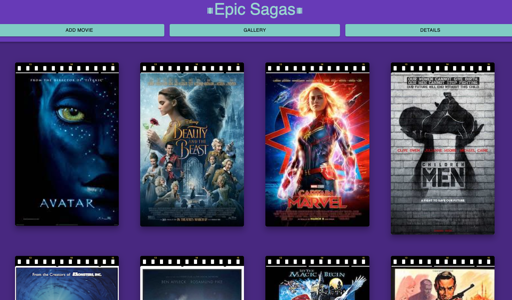
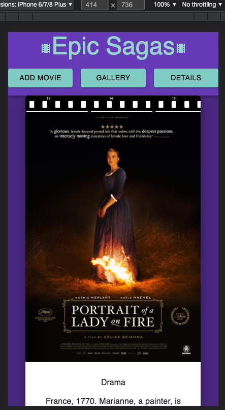
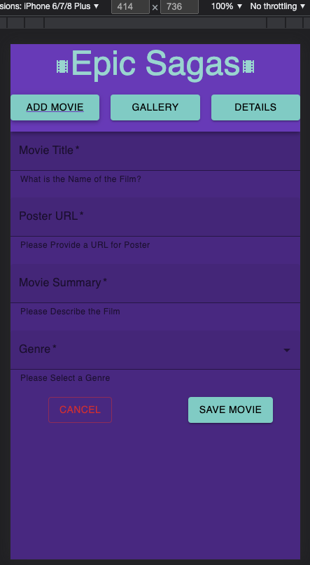

# Project Name

Epic Sagas

## Description

- Duration: 2 day sprint

Epic Sagas is a full-stack app utilizing React/Redux/Sagas, Node/Express/Postgres, styling in Material UI for full mobile and cross-platform browser functionality, and practice implementing WCAG accessibility on some elements.

The base functionality (default view) is a responsive gallery list of the posters of movies in the database that uses MUI Grid and Card to adjust to browser view media breakpoints. There is an Add Form utilizing MUI Grid and Textfield that requires Movie title, poster URL, Movie description, and a Genre assignment. When submitted, the user inputs are dispatched to a React-Saga, and sent via Axios HTTP request to the Express server, which in turn uses Postgres and Axios to save the information to the database. When the user clicks on any of the movies in Gallery view, the ID is captured by a Saga and stored in a Reducer, and navigated to the Details page. The Details page issues a Saga Axios GET to the server, where a many-many Join query gathers movie details and genre information, and stores them in Reducers. This information is then rendered to the DOM on the Details view. 

One other stretch accomplishments was learning how to design a custom MUI Theme palette and using ThemeProvider to apply it to this app's implementation of materials. After accomplishing base mode, I spent the majority of my time continuing to research and implement MUI Components and Accessibility.

## Screenshots

### Installation
  Use this template to copy over to a fresh repository, and clone down to your local IDE of choice. Double check the dependencies in package.json, and then run 'npm install'. You will also want to set up a database based on the information in data.sql.
  
  Once your node/modules are all in place, use one terminal 'npm run server' to spin up the Express server on port 5000, then another 'npm run client' to spin up the React client on port 3000.

### Built With
  - Front end: React, Redux, Javascript, HTML/JSX, Material UI
  - Back end: Node.js, Express, Postgres, Postico, SQL, Git

### Acknowledgement
  Thanks to Prime Digital Academy, my instructor Matt Black, my Gemini cohort for bouncing all sorts of neat ideas off of, and my family keeping the home front while I'm so busy with school!

### Support
  Bugs, Questions, Input, Feedback, please reach out to Allen.JoeG@gmail.com